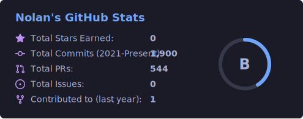

# Hey, I'm Nolan 👋

### Full-stack engineer • Go + TypeScript • Shipping aviation software at Proflyt ✈️

I build fast, maintainable systems end to end. Go APIs on the back, Next.js on the front, and the heaviest breakdowns you can feed me on repeat. 🤘🏻

### 🔭 What I'm building

At Proflyt, I'm building **Nexus**, an aviation crew scheduling and operations platform. The backend is Go with Gin and GORM, the frontend is Next.js 14 on the App Router, and it runs on PostgreSQL deployed to Railway. I cover the whole surface with Playwright end-to-end tests, and the UI is built on a custom atomic design system.

On the side, I'm designing and shipping **[cozybooking.co](https://cozybooking.co)** entirely on my own, from the database all the way to the front end.

### 🛠️ Tech I work in

### 💡 How I work

I like to own the full stack, from the database to the API to the pixels. Before I touch a codebase I read it, and I work to preserve what already works while making it better. I keep my code lean with early returns and clear patterns, avoiding cleverness for its own sake, and I always verify a change live before I call it done.

### 📊 GitHub at a glance

Most of my work lives in private Proflyt repositories. The card below is generated from my own token, so it counts that private work and reflects my real commit total. The languages card only sees my public repositories.

### 🎮 Off the clock

When I'm not writing code, I'm grinding **Dead by Daylight** and chasing the heaviest breakdowns in metal. 🔪🎸

### 📫 Reach me

He/Him
